<table align="center">
  <tr>
    <td></td>
    <td><h1>Bala: A 2D Bullet Heaven Game Engine (Frontend)</h1></td>
  </tr>
</table>

<p>Bala is a 2D bullet heaven game engine built with Java and LWJGL designed to help novice developers easily create top-down games. It features procedural generation using Simplex and Perlin Noise collision detection with AABB and circle-circle methods and flocking AI for NPC behavior. The engine also includes tools for performance testing through frame time logs.</p>

<p>In this repository, the frontend website is built using <strong>React.js</strong>, <strong>Vite</strong>, and <strong>Tailwind CSS</strong>. It showcases a simple webpage that explains what our game engine is all about. The site includes detailed installation instructions through a user manual and a video demonstration. Additionally, it provides direct download links for the <strong>installers</strong> for <strong>Windows</strong>, <strong>Linux</strong>, and <strong>macOS</strong>, as well as a <strong>Docker image</strong> that can be installed directly through the provided <strong>Docker commands</strong>.</p>

<h2>🐳 Docker Setup and Management:</h2>

<p>1. Build Docker Image</p>

- Use this command to build the Docker image and tag it as <code>bala-frontend:v1.0</code>.

```
docker build . -t "bala-frontend:v1.0"
```

<p>2. View Docker Images</p>

- Use this command to list all Docker images available on your system.

```
docker images
```

<p>3. Run the Docker Container</p>

- Run the Docker container and map port <code>5796</code> from the container to your local machine.

```
docker run -p 5796:5796 bala-frontend:v1.0
```

<p>4. View Running Containers</p>

- Use this command to display all currently running containers.

```
docker ps
```

<p>5. Stop the Running Container</p>

- Stop the running container using its container ID or name.

```
docker stop bala-frontend:v1.0
```

<p>6. Remove the Stopped Container</p>

- Use this command to remove the stopped container from your system.

```
docker rm bala-frontend:v1.0
```

<p>7. Remove the Docker Image</p>

- Remove the Docker image from your system to free up space.

```
docker rmi bala-frontend:v1.0
```

<p>8. (Optional) Clean Up All Unused Data</p>

- Use this command to remove all unused containers, networks, images, and cache.

```
docker system prune -a
```

<p>📘 For more detailed setup instructions, please refer to the <a href="./src/assets/userManual.pdf" target="_blank"><strong>BALA Official User Manual</strong></a> and <a href="https://youtu.be/OgHXvgHwgFo?si=_6pBDtCqPHzYogJq" target="_blank"><strong>BALA Official Video Demonstration</strong></a>.</p>

<h2>🖼️ Frontend Website Preview:</h2> <p>Below is a preview of the Bala Frontend website showcasing its interface and responsive design in both <strong>light</strong> and <strong>dark modes</strong>, as well as on <strong>web</strong> and <strong>mobile</strong> displays.</p> <p align="center">
<p align="center">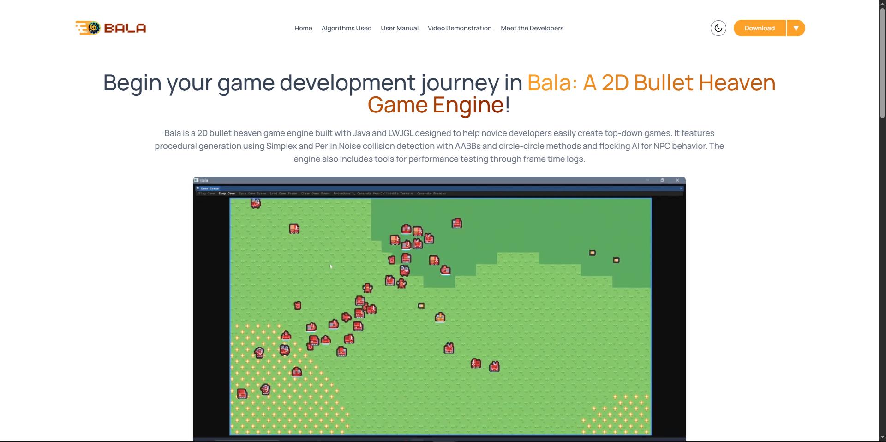<br/></p>
<p align="center">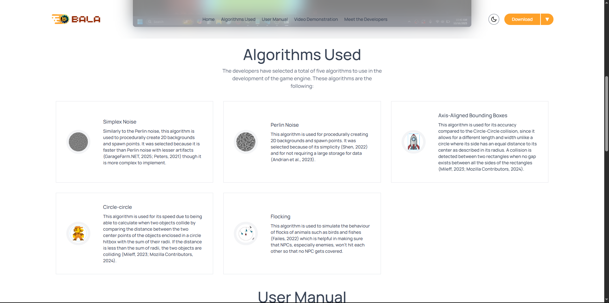<br/></p>
<p align="center">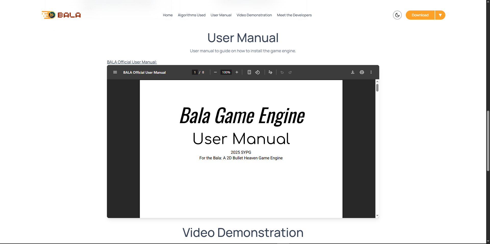<br/></p>
<p align="center">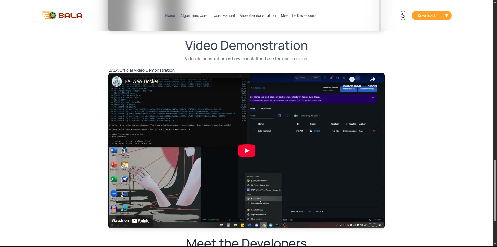<br/></p>
<p align="center">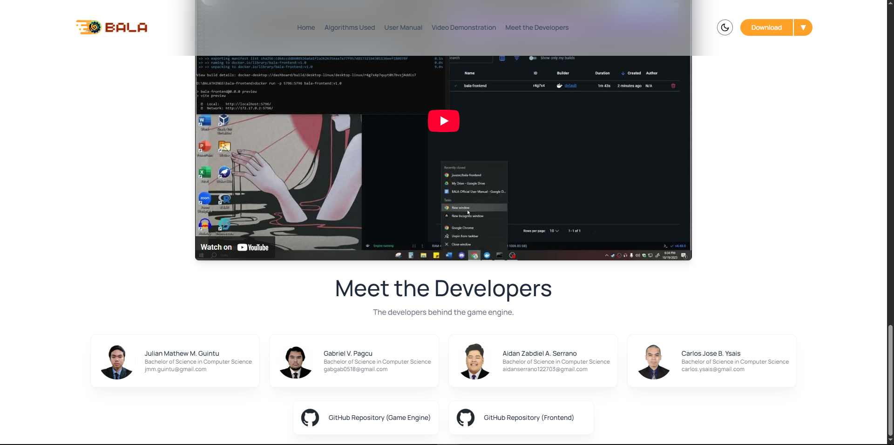<br/></p>
<p align="center"><em>Light Mode (Web View)</em></p>

<p align="center">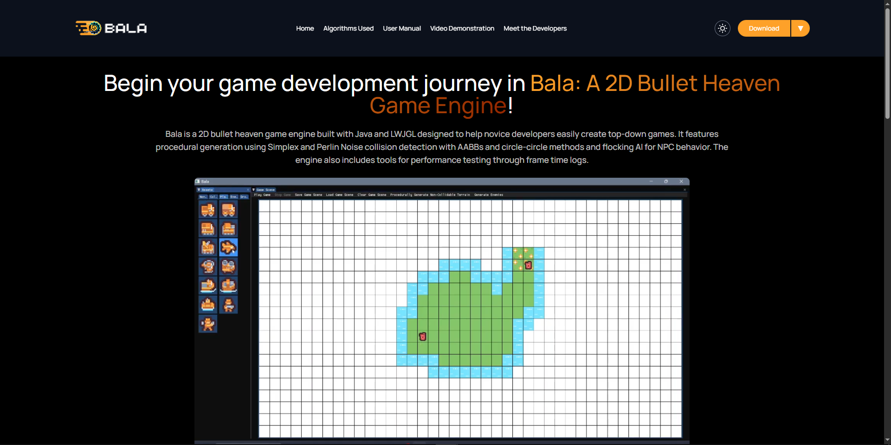<br/></p>
<p align="center">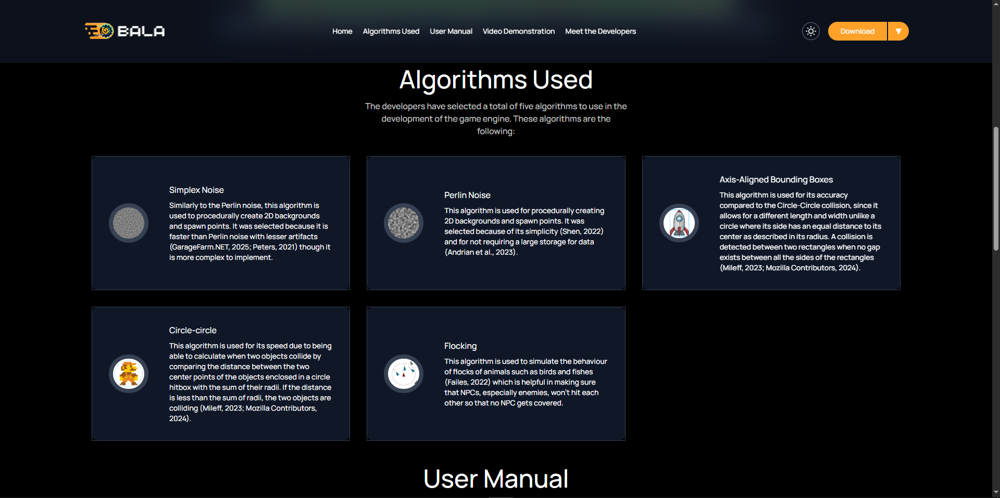<br/></p>
<p align="center">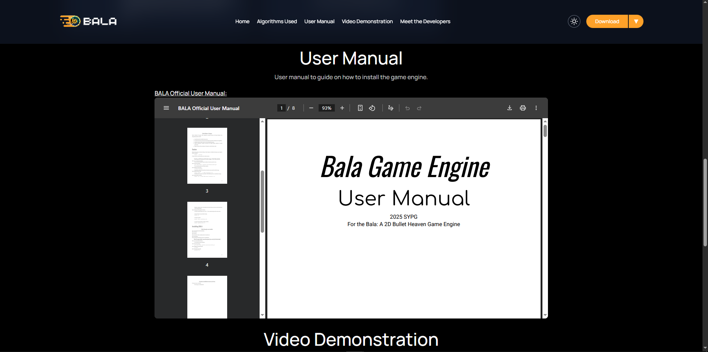<br/></p>
<p align="center">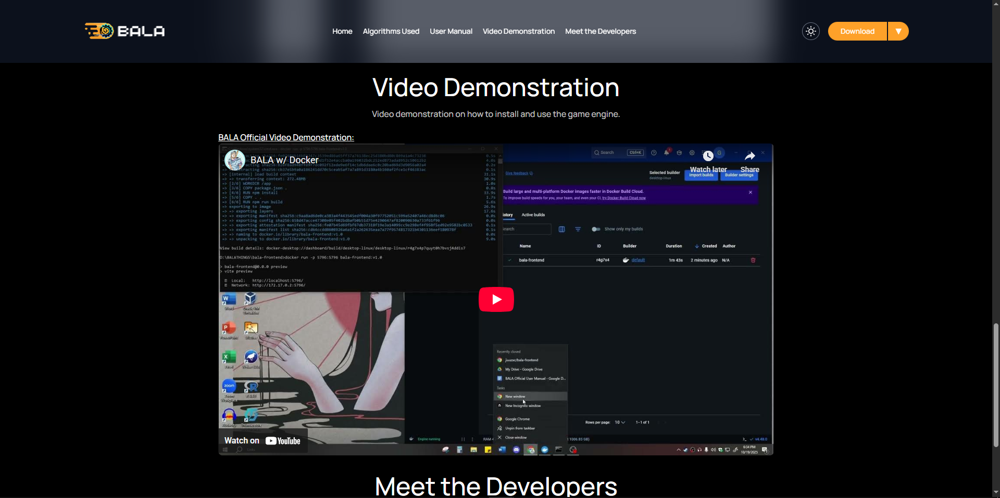<br/></p>
<p align="center">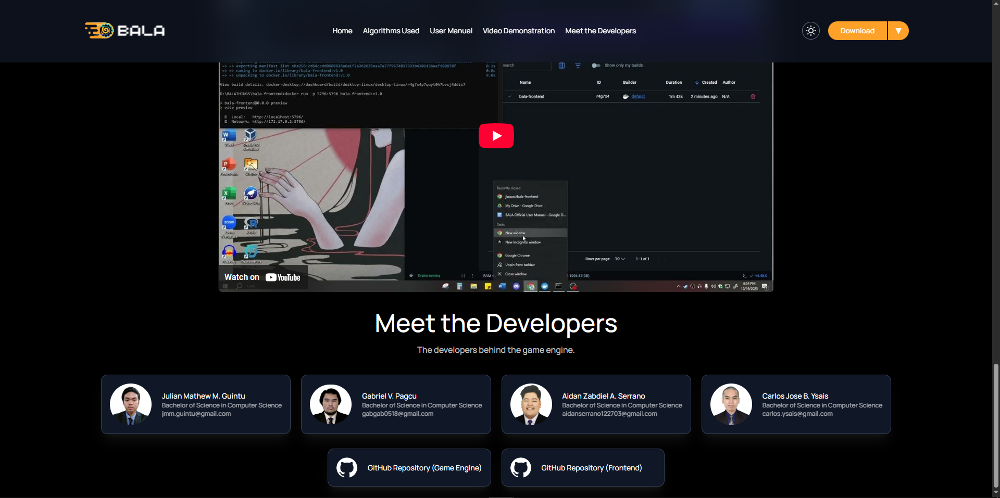<br/></p>
<p align="center"><em>Dark Mode (Web View)</em></p>

<p align="center">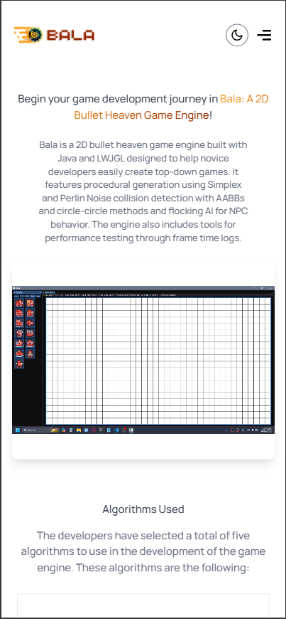<br/></p>
<p align="center">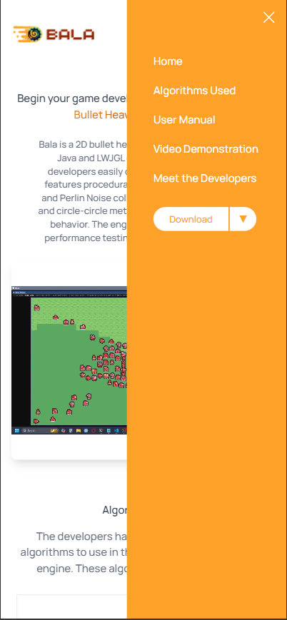<br/></p>
<p align="center"><em>Light Mode (Mobile View)</em></p>

<p align="center">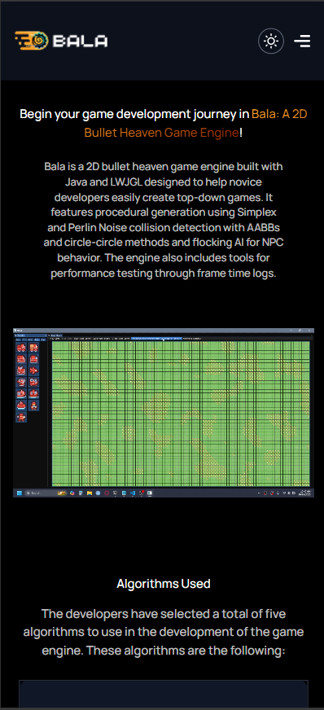<br/></p>
<p align="center">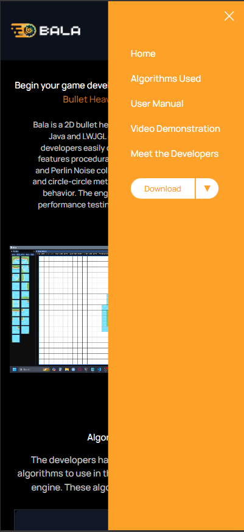<br/></p>
<p align="center"><em>Dark Mode (Mobile View)</em></p>

<h2>©️ Credits</h2>

- **Game Engine Repository**: [Bala: A 2D Bullet Heaven Game Engine](https://github.com/aiaiaiex/bala/)